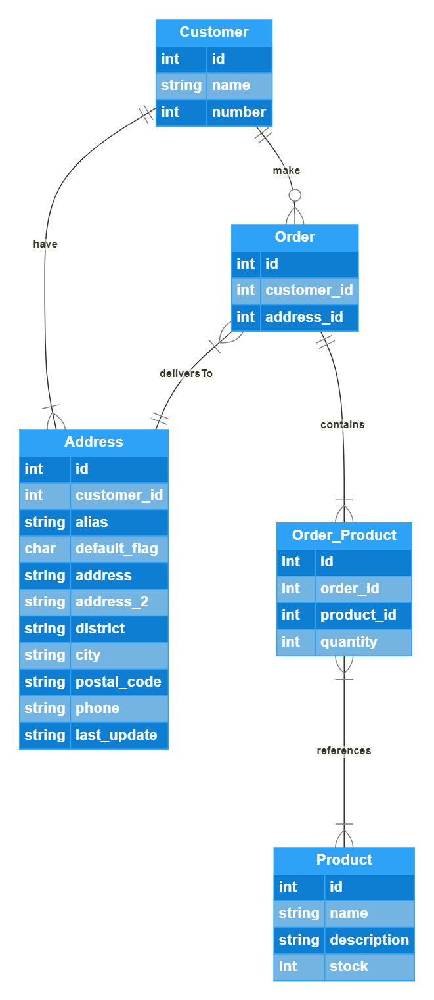

# 1SCJRBB-2022-persistence

## Montando e Rodando, ôe

Pré-requisito:

- Docker
- Postman

> \> Clonar o repositório

> \> RUN docker-compose up

> \> Importar no Postman a collection loja.postman_collection para auxiliar no uso do aplicativo

O docker-compose vai subir os bancos de dados e montar os databases, tabelas e dados mockados, baixar as dependências do maven, compilar o projeto e executar a aplicação.

Optamos pelo MongoDB por estarmos mais familiarizados com esse banco NoSQL. É mais fácil de manipular documentos do que tabelas relacionais. A aplicação foi planejada para ser usada via requisições http (REST API), compatível com aplicações web, que são padrão hoje em dia, fazendo mais sentido em um projeto de ecommerce.

Criamos ainda o mesmo banco de dados com a mesma estrutura de dados em MySQL como prova de conceito.

Para o Modelo de Entidade-Relacionamento optamos desenhamos o mínimo possível para efetuar uma compra, ignorando métodos de pagamento, seguindo  o enunciado e mantendo a simplicidade para garantir a entrega de um MVP funcional. Usamos o [Gleek.io](https://gleek.io) para o desenho.

Na definição do projeto java usamos um criador de boilerplate para projetos Spring chamado [Spring Initializr](https://start.spring.io/) para reduzirmos o overhead de código mínimo necessário, minimizando o overhead de código produtivo.

Em termos de dependências escolhemos o maven, por familiaridade. 

## Entity-Relationship Diagram

Created with [Gleek.io](https://gleek.io) diagram maker

## Enunciado da Avaliação

Trata-se de um sistema de cadastro de produtos e pedidos em um portal de e-commerce.

Considere os requisitos:

> O portal possui vários produtos em estoque e com uma determinada quantidade em estoque de cada um desses produtos.
> Cada pedido possui um ou mais produtos e um cliente associado a esse pedido.
> Um produto pode aparecer em um ou mais pedidos.
> Cada produto possui um código, um nome, uma quantidade e um valor.
> Cada cliente possui seus dados pessoais e dados de entrega.

Com base nestes requisitos:

1. Escrever o modelo do banco de dados (o famoso MER).
2. Definir as entidades necessárias.
3. Desenvolver uma aplicação, do tipo Java Project, onde todas as informações são fornecidas pelo usuário.
4. Utilizar o Maven ou Gradle para o gerenciamento de dependências.
5. Esse sistema deve ser desenvolvido utilizando uma das cinco combinações de técnicas:
a. Spring Data JPA + Cache Redis (os dois em um único projeto).
b. Spring Data JPA (em um projeto separado) e Neo4J (em outro projeto separado).
c. Spring Data JPA (em um projeto separado) e MongoDB (em outro projeto separado, sendo que neste projeto considere que pode existir um ou mais endereços de entrega cadastrados).
d. Cassandra (em outro projeto separado, lembrando que o Cassandra não suporta relacionamentos, então a lógica associada a isso deverá ser implementada pela aplicação).
e. Elaboração de Dockerfile ou Docker Compose referente a dois bancos de dados utilizados na disciplina, envolvendo o processo de clonagem de um repo até a disponibilização do ambiente (nesse caso basta construir um projeto básico para provar o conceito).

6. Documentar e justificar a escolha das técnicas, assim como as decisões técnicas e de arquiteturas do sistema.

> O trabalho pode ser realizado em grupos de até 6 pessoas.
> Compactar o projeto completo (ou colocar o link do repo no Github) e disponibilizá-lo no portal da Fiap até a data estipulada.
> Entregar, junto com o projeto, um documento descrevendo todos os passos desenvolvidos ao longo da elaboração do projeto, incluindo o modelo do banco de dados, funcionalidade, etc.

Trabalhos iguais serão anulados!

Bom trabalho a todos!
Prof. Rafael Matsuyama

## PS: Copia nós não, plz

## Nósquipe

Carlos Mateus Borges Junior - RM344974

Daniel de Oliveira Carvalho - RM344795

Pedro Sant Anna Lima Oliveira - RM344804

Willian Prestes Correia Cellos - RM344812
